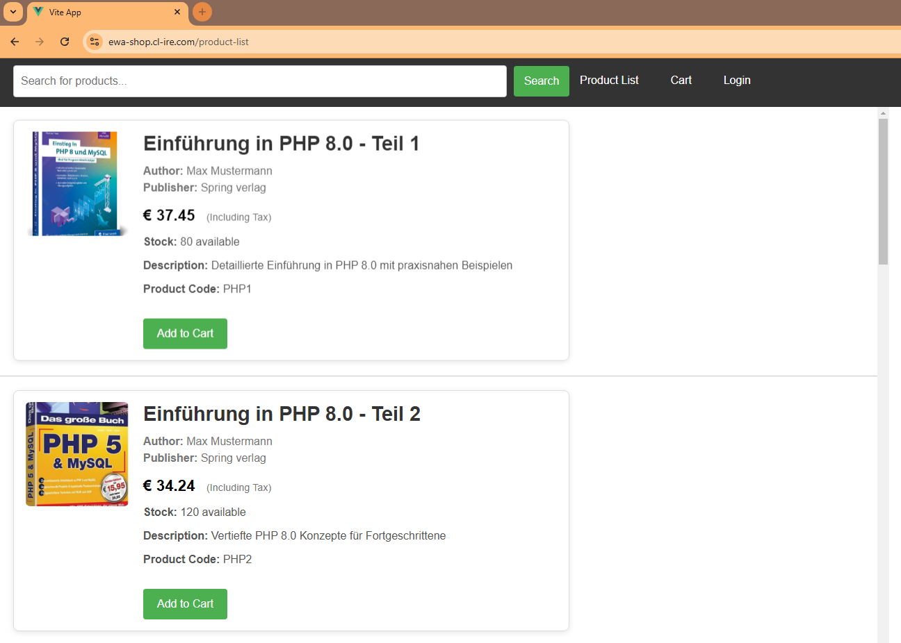
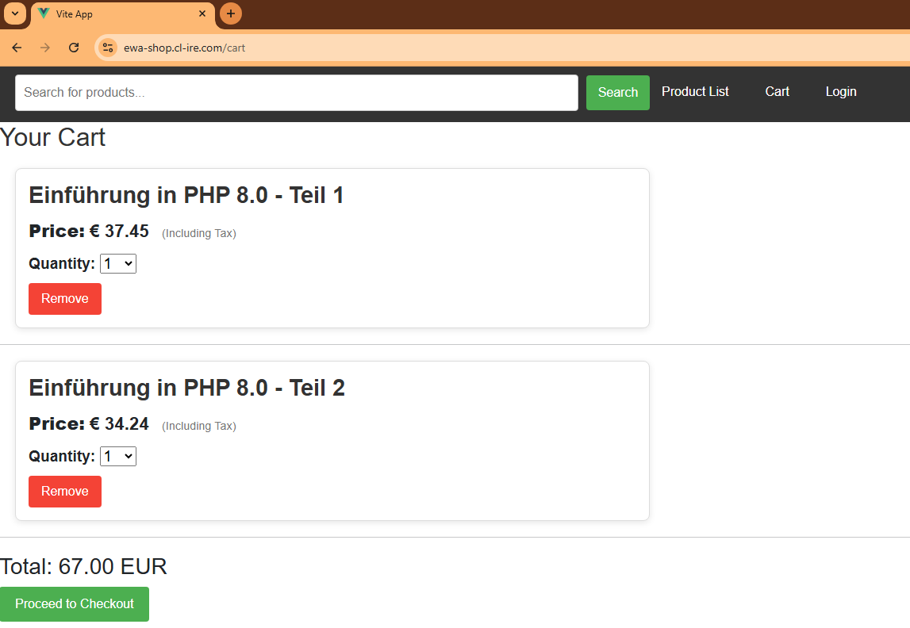
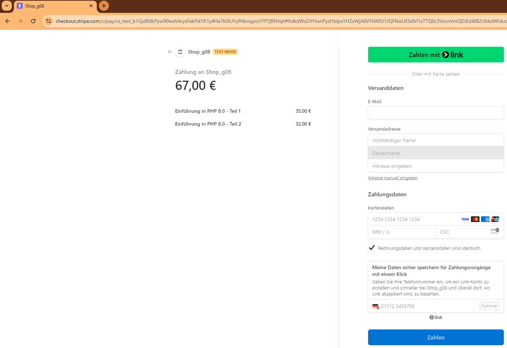
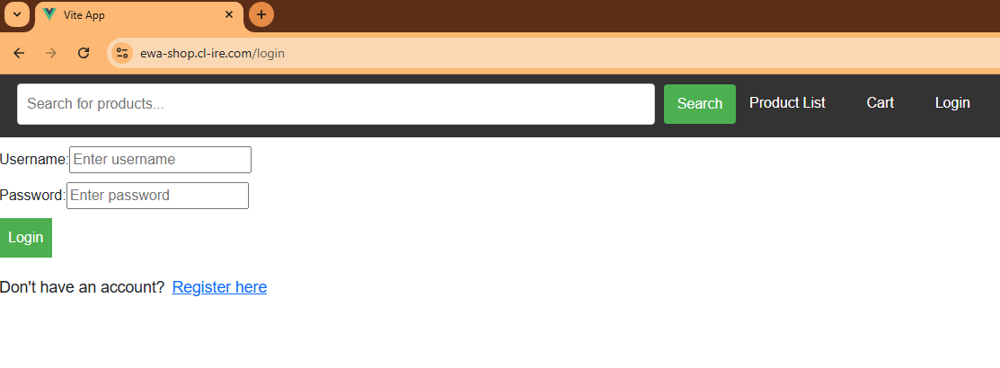

# ewa shop g08




A modern shop application leveraging **Vue.js**, **Node.js**, **MariaDB**, and **NGINX**, containerized with **Docker** for seamless deployment and scalability. The application allows users to browse gifts, search items, manage orders, and simulate payments, all in an efficient and visually engaging SPA.

## Features
- **Catalog:** Displays a list of items with images fetched dynamically.
- **Search Functionality:** Real-time item filtering based on user queries.
- **Shopping Cart:** Manage selected items, view order totals, and calculate VAT (7%).
 
- **Secure Payments:** Integrated with Stripe API for payment simulation.
  
- **Admin Dashboard:** Manage orders, update inventory, and view sales.
  
- **Responsive Design:** Built for usability across devices.


## Technologies Used
- **Frontend:** Vue.js (SPA framework)
- **Backend:** Node.js (server), MariaDB (database)
- **Web Server:** NGINX
- **Payment Integration:** Stripe API (test mode)
- **Containerization:** Docker

## Deployment with Docker
This project is fully containerized using Docker. Key components include:
1. **Frontend:** A Vue.js app served via NGINX.
   - Built using `node:22`, optimized for production, and deployed on NGINX (`stable-alpine`).
2. **Backend API:** A Node.js server running on `node:22`.
3. **Database:** MariaDB for storing and managing product and order data.
4. **Custom NGINX Configuration:** Configured for serving static files and handling requests efficiently.
5. **Dockerized Initialization Scripts:** Automates database setup.


## project structure

```bash
├── backend
│   ├── Dockerfile.backend
│   ├── package.json
│   ├── package-lock.json
│   └── server.js
├── Docker
│   ├── docker-compose.yml
│   └── env_template
├── mariadb
│   ├── Dockerfile.mariadb
│   ├── hashPassword.js
│   ├── init_tables.sh
│   └── setup
│       ├── init_table.sql
│       └── init_users.sql
├── README.md
├── test
│   └── vuedemo2_ProdList.html
└── vue
    ├── Dockerfile.vue
    ├── env_template
    ├── img
    │   ├── C1.jpg
    │   ├── C2.jpg
    │   ├── JAVA1.jpg
    │   ├── JAVA2.jpg
    │   ├── JS1.jpg
    │   ├── JS2.jpg
    │   ├── PHP1.jpg
    │   ├── PHP2.jpg
    │   ├── PYTHON1.jpg
    │   └── PYTHON2.jpg
    ├── index.html
    ├── jsconfig.json
    ├── nginx.conf
    ├── package.json
    ├── package-lock.json
    ├── public
    │   └── favicon.ico
    ├── README.md
    ├── src
    │   ├── App.vue
    │   ├── assets
    │   │   ├── base.css
    │   │   ├── logo.svg
    │   │   └── main.css
    │   ├── components
    │   │   ├── AdminItem.vue
    │   │   ├── Admin.vue
    │   │   ├── CartItem.vue
    │   │   ├── Cart.vue
    │   │   ├── Home.vue
    │   │   ├── Login.vue
    │   │   ├── Navbar.vue
    │   │   ├── OrderItem.vue
    │   │   ├── Order.vue
    │   │   ├── ProductList2.vue
    │   │   ├── ProductList.vue
    │   │   ├── Product.vue
    │   │   ├── Register.vue
    │   │   └── Success.vue
    │   ├── config
    │   ├── main.js
    │   ├── router
    │   │   └── router.js
    │   ├── store
    │   │   └── store.js
    │   ├── utils
    │   │   └── apiFunctions.js
    │   └── views
    └── vite.config.js
```


## Setup guide

### setup `.env` files

copy the [`env_template`](./Docker/env_template) and rename it in `.env` 

add your stripe `STRIPE_SECRET_KEY` and your `VUE_APP_STRIPE_PUBLISHABLE_KEY`

for production deployment change CLIENT_URL to your domain 


then copy the secon [`env_template`](./vue/env_template) and rename it in `.env` 

this is needed because vue is weird with `.env` files

add your `VUE_APP_STRIPE_PUBLISHABLE_KEY` 

for production deployment change `VUE_CLIENT_URL` to your domain 


### start the app

```bash
cd ewa_geschenke_shop/Docker/

docker compose up -d

```


if your using a local configuration you can now acces your app under 

[http://localhost:8080](http://localhost:8080)


### change default products 

to change the products you have to alter the sql file that populates the databse 

[sql_file](./mariadb/setup/init_table.sql)

after doing so you can flus the tables with 

```bash
cd ewa_geschenke_shop/Docker/

docker compose down -v

```